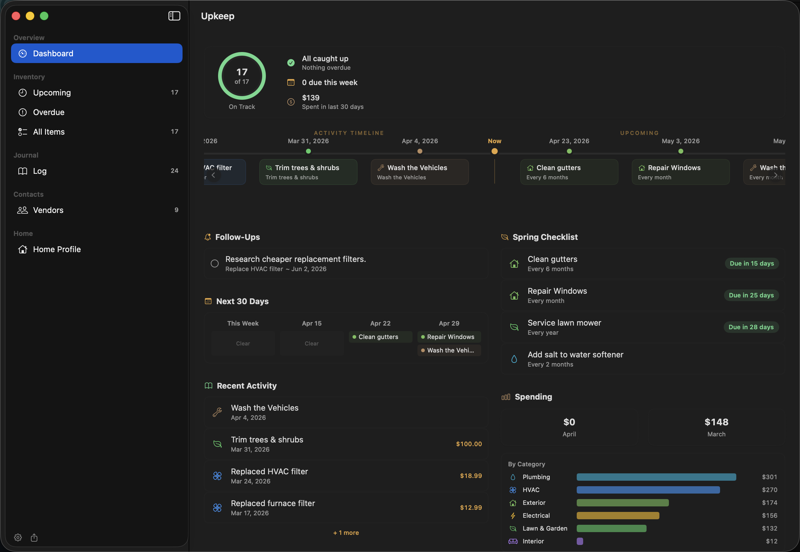
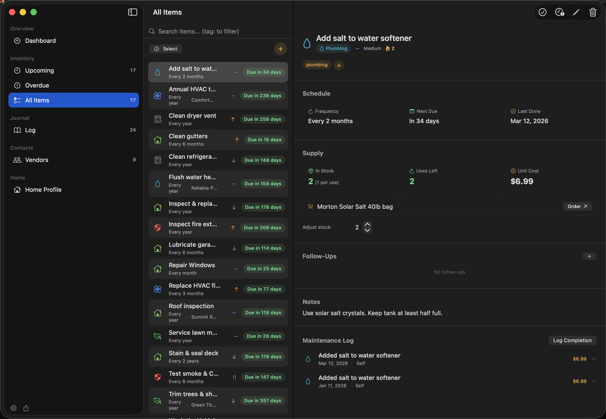

# Upkeep

A macOS app for tracking home maintenance schedules, logging work, and managing vendors. Built for households that want to stay on top of recurring maintenance without spreadsheets.





## Features

**Inventory**
- Four schedule types: **Recurring** (every N days/weeks/months/years), **Seasonal** (annual windows like "May 25 – Jul 7"), **To-do** (one-time fixes with a due-by date), and **Ideas** (undated wishlist items — future projects you're mulling over, with notes, follow-ups, vendor research, and cost tracking)
- To-do items auto-deactivate when logged as complete (configurable in Settings)
- Custom SF Symbol icon per item (curated picker + full-library search) overriding the category default
- Attachments on items and log entries: photos/PDFs copied into the shared data folder, PDF-by-link (don't copy), or URLs to external resources
- Priority levels, category tagging, and vendor assignment
- Supply tracking with stock levels, reorder alerts, and product links
- Follow-up tasks per item with due dates
- Snooze items to defer them temporarily
- Bulk actions: multi-select items for snooze, deactivate, or delete

**Journal**
- Log maintenance completions with date, cost, performer, and satisfaction rating
- Standalone log entries for one-off work not tied to an item
- Inline editing and expandable log rows

**Dashboard**
- Health overview with on-track progress ring
- Maintenance timeline showing recent and upcoming work
- Responsive two-column layout at wider window sizes
- Overdue items with quick-log buttons
- 30-day timeline, seasonal checklists, spending breakdown by category
- Follow-up and reorder alert sections

**Vendors**
- Contact info: phone, email, website, location (Google Maps Plus Codes, coordinates, DMS, or URLs)
- Account manager tracking (name, phone, email)
- Tags for filtering and categorization
- Context menu with copy phone/email

**Home Profile**
- Property details: address, year built, square footage
- Major systems tracking (HVAC, roof, water heater, etc.) with brand, model, install date, and lifespan
- Editable systems with add/edit/delete

**Other**
- Tag auto-suggest with full keyboard navigation (Tab, Arrow, Enter, Escape)
- Quick search across items, logs, vendors, follow-ups, and supply product names
- Keyboard shortcuts: Cmd-N (new item), Cmd-Shift-N (new log), Cmd-K/F (search)
- Undo/redo for all operations
- Sparkle auto-updates
- Multi-user support with household members and conflict detection
- Shared data storage (Google Drive or other synced folder) with local backups
- Export maintenance reports as HTML

## Requirements

- macOS 15.0 (Sequoia) or later

## Install

Download the latest DMG from [Releases](https://github.com/msjurset/upkeep-mac/releases), open it, and drag Upkeep to Applications.

Existing installations are notified of updates automatically via Sparkle.

### From source

```sh
make deploy
```

## Build

```sh
swift build              # debug build
make build               # release build
swift test               # unit tests (137 tests)
make uitest              # UI tests (15 tests, requires xcodegen)
make deploy              # build, bundle, install to /Applications
```

## Data Storage

Storage is split between shared and local directories:

- **Shared data** (configurable via Settings): items, logs, vendors, photos, home profile, household members. Can be pointed at a synced folder (e.g. Google Drive) for household sharing.
- **Local data** (`~/.upkeep/`): backups. Never synced.
- **Instance config** (`~/Library/Application Support/Upkeep/`): current member, data path, UI prefs.

### Setting up shared storage

1. Create a folder in your sync service (e.g. Google Drive)
2. Copy data: `cp -R ~/.upkeep/{items,log,vendors,photos,config.json,home.json,members.json} "/path/to/sync/folder/"`
3. In Upkeep, go to Settings > Data Location > Change... and select the folder
4. On other machines, install Upkeep and point it at the same shared folder

## Architecture

SwiftUI macOS app with `@Observable` + `@MainActor` state management. File-based JSON persistence via a `Persistence` actor. Scheduling logic extracted into a standalone `SchedulingService`.

- Swift 6.0, macOS 15.0+
- Sparkle for auto-updates
- No other external dependencies

## License

MIT
